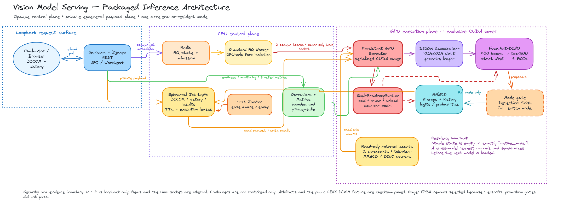

# MMBCD Inference Serving Implementation Report

## Summary

I built a containerized Django service that executes the supplied
FocalNet-DINO detector and MMBCD classifier over mammogram DICOM inputs. The
service supports detector-only and full two-stage inference, exposes an
asynchronous REST API and inspection workbench, and enforces the assignment's
requirement that at most one model is accelerator-resident at a time.

My main engineering objective was not merely to make the models run, but to
make every important boundary explicit: artifact identity, DICOM transforms,
model residency, queue ownership, private data retention, failure semantics,
and the difference between deterministic serving validation and clinical
validation.

Editable diagram source:
[`vision-model-serving-pipeline.excalidraw`](docs/architecture/vision-model-serving-pipeline.excalidraw).

## Implementation approach

### Contract-first model integration

I first reproduced both models outside the web layer and recorded their exact
inputs, outputs, dependency revisions, checkpoint sizes/hashes, and strict-load
expectations in a manifest. DICOM decoding produces a bounded, immutable
1024×1024 grayscale array plus a geometry ledger. FocalNet-DINO produces 900
queries; the adapter applies deterministic top-300 selection, strict NMS, and
selects exactly eight ordered ROIs. Full mode crops those ROIs and combines
them with the label-free clinical-history prompt expected by MMBCD.

The pipeline returns typed, serialization-safe host values with geometry,
provenance, timings, warnings, logits/probabilities, and prediction hashes. I
intentionally do not expose diagnostic class names or a decision threshold:
the supplied artifacts do not verify those semantics, and inventing them would
make the API appear more clinically authoritative than the evidence supports.

### Separate control-plane and GPU lifecycles

Django handles validation, submission, polling, result serialization, and the
browser workbench. Redis/RQ owns the durable job lifecycle, but Redis receives
only opaque identifiers—not DICOM bytes, clinical history, or prediction
results. Sensitive payloads live in a bounded tmpfs job store with TTLs,
fingerprint verification, execution leases, atomic cleanup, and an independent
janitor.

I selected RQ instead of Celery because this deployment has one serialized GPU
queue and does not need routing, task graphs, scheduling, or multiple worker
pools. I retained RQ's standard forked work-horse for failure isolation, but
moved CUDA ownership into a separate persistent executor reached through an
owner-only Unix socket. This preserves queue heartbeats and per-job isolation
without reconstructing and re-verifying the complete ML stack in every
work-horse.

`SingleResidencyRuntime` is the sole model-lifecycle implementation. A
same-model request can reuse the resident model; a cross-model request drains
inference, unloads the current adapter, synchronizes CUDA, clears allocator
state, and then loads the next model. A full request therefore ends with MMBCD
as the only resident model. This design deliberately prioritizes the explicit
assignment contract over the lower latency of keeping both models resident.

### Deployment and operational design

Only the executor image receives an NVIDIA device and read-only checkpoint,
tokenizer, and source mounts. The CPU web/RQ image contains no PyTorch. Images
run non-root with read-only filesystems, dropped capabilities, bounded tmpfs
volumes, internal Redis/socket networks, and a loopback-only HTTP publication.
Model weights are not committed or baked into an image.

Evaluator-facing build, startup, readiness, frontend inference, monitoring,
and teardown steps are provided in the
[README quick start](README.md#evaluator-quick-start-run-the-inference-application).

The service exposes liveness, artifact-scoped readiness, model inventory,
OpenAPI, structured operations, a monitoring page, and optional trusted-network
Prometheus export. Telemetry uses bounded labels and excludes clinical text,
DICOM identifiers, filenames, local paths, and raw exception messages.

## Challenges and debugging process

| Challenge | Diagnosis and resolution |
| --- | --- |
| Reproducing research code on the pinned L4 stack | I used strict checkpoint loading, offline assets, deterministic FP32 execution, and checksum-pinned upstream revisions. Three narrow FocalNet compatibility patches and a compiled `MultiScaleDeformableAttention` operator are verified during the image build. |
| RQ inference was initially slow | Timing showed RQ task entry took less than a millisecond; the real cost was rebuilding and verifying the pipeline in each forked work-horse. I retained RQ but introduced the persistent GPU executor, separating queue lifecycle from CUDA lifecycle. |
| A faster dual-resident design conflicted with the assignment | I recorded the conflict in ADR 0003 and replaced dual residency with a max-one state machine. Historical faster evidence remains archived but is explicitly superseded. |
| Border detections and ROI crops differed from the reference path | I traced the mismatch to premature clipping and crop-coordinate behavior. The detector now preserves intentional border overhang for NMS and zero-padded crops, while browser coordinates remain clipped and cross-coordinate consistency is validated. |
| Failure, expiry, and worker-loss races could leak capacity or private files | I introduced typed terminal markers, atomic Redis admission, execution leases, deletion-on-access, a periodic janitor, and a strict deadline hierarchy ending in executor restart. Automatic inference retries remain disabled because GPU failure may leave execution state uncertain. |
| Live L4/browser validation exposed packaging seams | The acceptance client was polling faster than the API throttle, privacy validation lacked group-readable result files, monitoring read a stale field, and native build intermediates remained in the executor. I fixed each issue with focused regressions and reran the complete packaged campaign. |
| TensorRT showed partial promise but failed production gates | A static-width MMBCD diagnostic was feasible, but required dynamic MMBCD coverage failed and FocalNet-DINO capture stopped before complete detector compilation. I kept eager FP32 rather than adding a silent fallback or promoting an incomplete engine. |

### Optional TensorRT investigation

I evaluated the assignment's optional TensorRT path on the NVIDIA L4 using a
strict, no-fallback promotion lane: `torch.export`, full FP32 TensorRT
compilation with zero PyTorch partitions, TensorRT-only plan execution,
numerical parity, performance, and complete production input-shape coverage.
MMBCD compiled successfully for the public fixture's fixed token width of five
and improved isolated warm forward-pass p50 by 27.79%. However, the service
accepts unpadded token widths from 2 through 90, and strict export of that
dynamic profile failed an exporter shape guard. I therefore deleted the
fixed-width plan instead of narrowing the API contract or silently falling
back to PyTorch.

FocalNet-DINO failed earlier during strict export: its upstream `NestedTensor`
constructor compared a traced mask with the string `"auto"`, producing a value
Dynamo could not represent. Engine construction was never reached. The model
also retains a separate downstream blocker: its custom
`MultiScaleDeformableAttention` CUDA operation has no validated TensorRT plugin
or equivalent full-graph decomposition. The measured decision was consequently
**STOP**; production remains eager FP32 with TF32 disabled. The full evidence
and rejected alternatives are recorded in the
[TensorRT failure analysis](docs/validation/tensorrt-l4-20260810/failure-analysis.md).

## Important design decisions

The ADRs capture three consequential decisions:

1. **[RQ is the job-lifecycle authority](docs/adr/0001-use-rq-for-gpu-job-execution.md).** It is a scope choice for one queue,
   not a claim that RQ is universally better or faster than Celery.
2. **[A persistent executor owns CUDA](docs/adr/0002-use-a-persistent-gpu-executor.md).** Queue processes never import model
   factories or initialize CUDA; the private socket is synchronous IPC, not a
   second queue.
3. **[At most one model is resident](docs/adr/0003-enforce-single-model-residency.md).** Compatible requests reuse the active
   model, while detector/classifier switches unload before loading the next
   stage.

Other deliberate decisions were to keep artifacts external and manifest-owned,
return raw indices/probabilities instead of invented medical labels, reject
cross-site browser mutation requests, and make every optimization/evidence lane
fail closed when identity or parity changes.

## Validation and current boundary

The final packaged campaign ran on an NVIDIA L4 with the checksum-pinned public
CBIS-DDSM DICOM. It reproduced the exact detector and classifier hashes through
Django → Redis/RQ → persistent executor → FocalNet-DINO → MMBCD. Two inference
cycles passed before complete volume destruction and two more passed after
restart with identical behavior, verified max-one residency, and successful
privacy cleanup. Real Chromium passed upload, preview, polling, eight ROI
overlays/crops, attention inspection, JSON/PNG export, and monitoring with zero
console errors. The complete local and Linux suites each passed 287 tests.

This is production-oriented, not clinically or fully production validated. One
public Secondary Capture fixture does not establish accuracy, calibration,
robustness, native mammography coverage, or clinical utility. Authentication,
TLS ingress, HA/multi-replica routing, a clean-revision schema-v4 benchmark, and
a long worker/model-switch resource soak remain outside the completed bounded
assessment. Checkpoint redistribution rights and the MMBCD source license also
remain external constraints.
