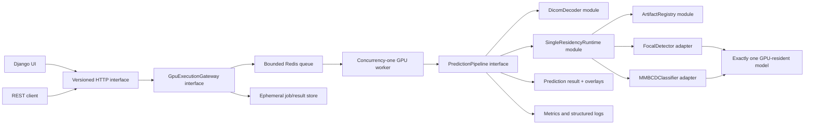
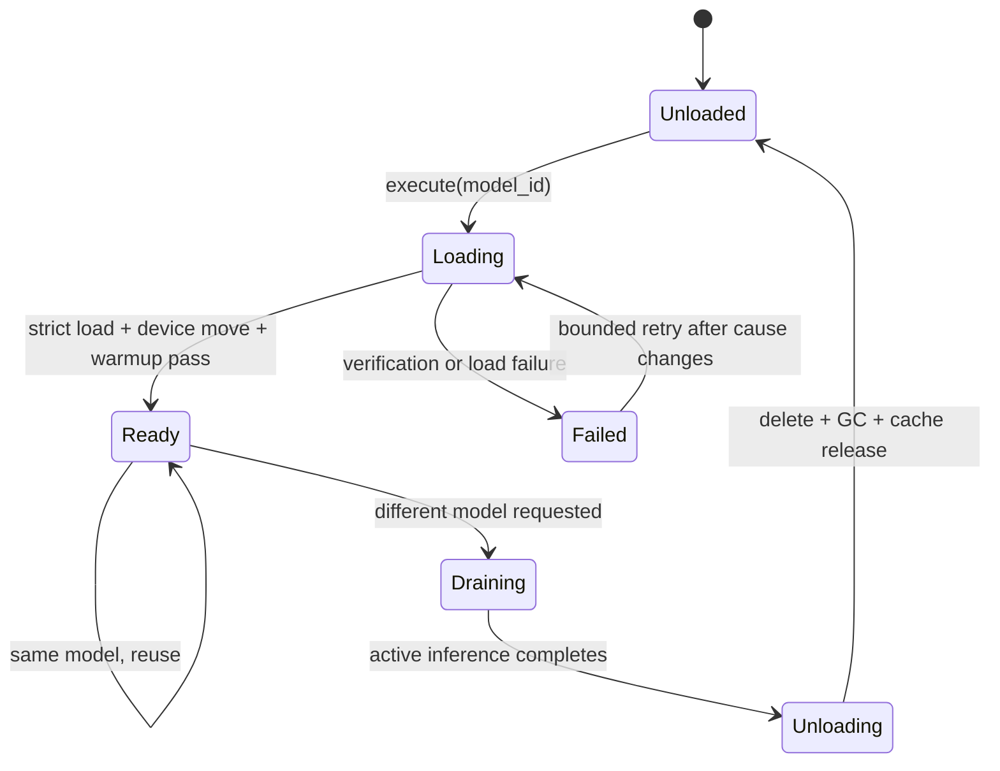

# Vision Model Serving: Implementation Plan and Technical Specification

**Status:** Proposed for review
**Date:** 2026-08-03
**Primary goal:** Deliver the assignment completely, while demonstrating senior-level ML serving, validation, operability, and product judgment.
**Safety posture:** Research and engineering demonstration only. This system is not a medical device and its output must not be presented as a diagnosis.

## 1. Executive decision

Build a modular Django application around the two-stage MMBCD inference path:

1. Decode and normalize one mammography DICOM.
2. Run the FocalNet-L/DINO detector to propose regions of interest (ROIs).
3. Retain the configured top-K proposals and create ROI crops.
4. Unload the detector from the accelerator.
5. Load the MMBCD classifier, which combines DINO-ViT ROI embeddings with a RoBERTa clinical-history embedding.
6. Return detector results, the malignancy score, model provenance, warnings, and per-stage timings.

The deployment will separate the Django web process from one dedicated GPU-owner worker. A bounded Redis-backed queue carries only opaque job IDs; request payloads live in an ephemeral shared job volume and are deleted after completion. The GPU worker runs with concurrency one and owns the model runtime for its full lifetime. This prevents Gunicorn worker count from duplicating CUDA contexts or models, supports reliable frontend progress, and still starts locally with one Docker Compose command. A bounded synchronous compatibility endpoint will submit to the same worker and wait for completion for evaluator-friendly `curl` usage.

The enhanced submission will add a server-rendered frontend for DICOM upload and result inspection, ROI and attention visualization, explicit model-residency telemetry, Prometheus metrics, a reproducible benchmark harness, and an evidence-gated TensorRT investigation.

### Key interpretation

The assignment's two models are assumed to be:

- the FocalNet-DINO ROI detector; and
- the MMBCD multimodal malignancy classifier.

This is consistent with the [MMBCD paper](https://papers.miccai.org/miccai-2024/paper/1311_paper.pdf) and [official MMBCD repository](https://github.com/adsbansal/MMBCD). If the evaluator instead supplied two detector checkpoints, the artifact manifest and endpoint modes can support that, but the checkpoint inventory must settle the question before implementation.

### Important constraint reconciliation

The assignment says both "load once and reuse" and "use one model at a time, so it must load and unload the models." The implementable invariant is:

> The model runtime is initialized once per serving process. Exactly one model may be accelerator-resident. The active model is reused across compatible requests and is evicted only when a request requires the other model.

This invariant is testable and will be stated in the README rather than hiding the ambiguity.

## 2. Assignment traceability

| Assignment requirement | Planned evidence |
| --- | --- |
| Understand the models and inference pipeline | Artifact inventory, model contracts, preprocessing specification, upstream-parity golden tests |
| Build a Django inference service | Versioned REST endpoint, serializers, OpenAPI schema, stable error envelope, health/model endpoints |
| Load efficiently and reuse models | Single-residency runtime state machine, one serving process, warm reuse, switch metrics, concurrency tests |
| Keep the application clean and extensible | Deep modules and explicit interfaces for DICOM decoding, artifact verification, model runtime, and prediction orchestration |
| Consider TensorRT | Time-boxed export/engine spike with correctness and performance gates; no unsupported promise |
| Containerize | Reproducible CUDA build stage, non-root runtime, read-only model mount, Compose health checks |
| Document local reproduction | One-command setup, artifact verification command, example requests/responses, troubleshooting guide |
| Validate endpoints reliably | Unit, API, contract, golden, GPU integration, unload, concurrency, and container smoke tests |
| Test with a public mammography DICOM | A checksum-pinned, attributed sample fetched from [TCIA CBIS-DDSM](https://www.cancerimagingarchive.net/collection/cbis-ddsm/), plus synthetic fixtures for normal CI |
| Use one of two models at a time | Runtime-enforced residency invariant and GPU-memory assertions during switch tests |

## 3. What the supplied config establishes

`config_cfg.py` is an expanded training configuration, not by itself a complete serving contract.

| Setting | Meaning for serving |
| --- | --- |
| `modelname = 'dino'` | Build the DINO detector implementation registered by the upstream repository. |
| `backbone = 'focalnet_L_384_22k'` | Use the large FocalNet backbone with ImageNet-22K pretraining lineage. |
| `focal_levels = 3`, `focal_windows = 5` | Select the three-level focal modulation variant used by the checkpoint. |
| `enc_layers = 6`, `dec_layers = 6` | Six-layer deformable transformer encoder and decoder. |
| `hidden_dim = 256`, `nheads = 8` | Transformer width and head count. |
| `num_queries = 900` | The detector produces a large query set before selection. |
| `num_feature_levels = 4` | Four multiscale feature levels feed deformable attention. |
| `num_select = 300` | Upstream postprocessing takes the top 300 flattened class-query scores. |
| `nms_iou_threshold = -1` | Upstream detector postprocessing does not perform NMS. The MMBCD data path applies its own proposal suppression. |
| `use_checkpoint = True` | The inspected FocalNet forward path can activation-checkpoint blocks even outside training. Test disabling it for identical inference output and lower latency. |
| `num_classes = 1` | The checkpoint appears to have one output class, but the classification-head tensor shape is the authority. |
| `dn_labelbook_size = 2` | Denoising-training label space; it is not sufficient evidence for the inference class mapping. |
| augmentation scales up to 800, max size 1333 | The official inference transform resizes the shorter edge to 800, caps the longer edge at 1333, then applies ImageNet normalization. |
| training loss and optimizer settings | Retained for checkpoint provenance, but irrelevant to the serving interface. |

### Config and checkpoint gates

Implementation must not proceed on configuration inference alone. The artifact audit must verify:

- top-level checkpoint keys and whether weights live under `model`, `state_dict`, or another key;
- whether keys carry a `module.` prefix;
- classification-head output dimensions and class-index semantics;
- missing and unexpected keys under a strict load;
- whether the final detector checkpoint contains the full FocalNet backbone;
- whether the MMBCD checkpoint contains the DINO-ViT, RoBERTa, fusion, and classification weights;
- tensor dtypes, total parameter count, checkpoint byte size, and SHA-256 digest; and
- the exact preprocessing, top-K, NMS, crop, text-prompt, and tokenizer contract used during training.
- the missing detector-to-`*_preds.txt` proposal-generation behavior, ideally from an author-provided script or a golden image/proposal pair.

The upstream FocalNet-DINO constructor attempts to load a separate backbone checkpoint before the task checkpoint. The serving implementation must remove that training-time dependency when the full task checkpoint contains those weights; it must not silently download or partially initialize a backbone at startup.

The upstream DINO source also documents that its `num_classes` convention can depend on the maximum class ID. Therefore, `num_classes = 1` is accepted only if the checkpoint head shape and a golden inference agree.

## 4. Reconstructed inference contract

### 4.1 DICOM to canonical mammogram

The official MMBCD preprocessing code:

- reads `pixel_array` with pydicom;
- applies a VOI LUT;
- maps MONOCHROME2 from minimum intensity upward and inverts other photometric interpretations;
- min-max scales to unsigned 8-bit;
- removes surrounding black space; and
- resizes the mammogram to 1024 by 1024 before downstream use.

This behavior is a reference to reproduce, not production-quality code to copy unchanged. The serving decoder must explicitly define:

1. supported transfer syntaxes and decoder plugins;
2. single-frame versus multiframe behavior;
3. modality LUT/rescale ordering;
4. VOI LUT/window selection when multiple windows exist;
5. MONOCHROME1, MONOCHROME2, and presentation-LUT inversion;
6. zero-range and corrupt-pixel handling;
7. crop padding and no-contour fallback;
8. geometry transforms needed to map detections back to original DICOM coordinates; and
9. which non-identifying metadata may appear in a response.

The implementation should follow the current [pydicom pixel-data pipeline](https://pydicom.github.io/pydicom/stable/guides/user/working_with_pixel_data.html), but exact model parity takes priority over aesthetically preferable image processing. Any intentional difference from the training path needs an ablation or golden comparison.

### 4.2 Canonical mammogram to detector input

The official FocalNet-DINO inference notebook uses:

- RGB conversion;
- aspect-ratio-preserving resize to a shorter edge of 800 with longer edge capped at 1333;
- conversion to a CHW float tensor; and
- ImageNet mean `[0.485, 0.456, 0.406]` and standard deviation `[0.229, 0.224, 0.225]`.

The detector returns normalized center-format boxes and logits. Its postprocessor applies sigmoid scores, flattens class-query combinations, selects `num_select = 300`, converts boxes to XYXY, and scales them to the requested target dimensions.

### 4.3 Detector results to ROI crops

The MMBCD repository expects proposal rows with:

```text
center_x_normalized center_y_normalized width_normalized height_normalized confidence
```

The reference evaluation path applies NMS with an IoU threshold of `0.1`, retains the first eight proposals, and duplicates existing proposals if fewer than eight remain. That duplication is a training/evaluation compatibility behavior, but it needs explicit empty-proposal handling; the upstream `random.choices()` call fails when there are no proposals.

Serving behavior:

- preserve detector confidence ordering;
- apply deterministic NMS rather than the upstream repeated Python loop;
- select exactly eight ROIs for the released MMBCD checkpoint unless artifact evidence says otherwise;
- use a deterministic padding policy when 1-7 ROIs remain;
- use a documented full-image or centered fallback crop when zero ROIs remain;
- clamp boxes to image bounds and reject degenerate crops; and
- retain both original-image and canonical-image coordinates in the internal result.

### 4.4 ROI crops and clinical history to MMBCD input

The official classifier path uses:

- 8 RGB ROI crops per mammogram;
- each crop resized to 224 by 224;
- ImageNet normalization;
- a DINO ViT-S/8 image encoder producing 384-dimensional ROI features;
- max pooling across the ROI embeddings;
- `roberta-base` with hidden states enabled;
- tokenizer truncation at 90 tokens;
- the final-layer CLS embedding;
- 256-dimensional image and text projections;
- one-head cross-attention with clinical text as query and ROI embeddings as keys/values; and
- a two-logit classifier, with softmax index 1 treated as the cancer probability in the official evaluation script.

The prompt for a normal request will be `Indication: {clinical_history}`. Training/evaluation code sometimes removes history using known labels (`cancer` and `all_views_cancer`). Those labels do not exist at real inference time. This is a material train/serve-skew and possible leakage concern, so the service must not reproduce label-conditioned prompting. It must document the mismatch and validate the released checkpoint on an inference-realistic prompt before making quality claims.

### 4.5 Output interpretation

The API will expose:

- detector boxes and scores;
- the retained top-K ROIs;
- MMBCD logits and softmax probabilities;
- predicted class using the artifact manifest's threshold;
- ROI attention weights when they can be returned without changing numerical output;
- artifact versions and hashes;
- preprocessing and model warnings; and
- load, preprocess, detector, switch, classifier, postprocess, and end-to-end timings.

Attention weights will be labeled as model inspection data, not as a causal explanation or clinical evidence.

## 5. Scope

### 5.1 Mandatory, assignment-complete scope

- One DICOM mammogram per request.
- Detection-only and full-pipeline modes.
- Clinical history required for full-pipeline mode.
- One accelerator-resident model enforced at runtime.
- One dedicated GPU-owner worker with bounded admission and opaque job IDs.
- Versioned Django REST interface with JSON output.
- Model artifact verification and offline startup.
- Containerized NVIDIA GPU runtime.
- Reproducible public-DICOM smoke test.
- Automated test suite and example requests/responses.
- Architecture, operations, benchmark, and troubleshooting documentation.

### 5.2 High-value enhanced scope

- Server-rendered Django frontend with DICOM upload and history entry.
- PNG preview with overlay boxes, top-K ROI gallery, confidences, and ROI attention weights.
- Model residency, device, artifact hash, and stage timing panel.
- Prometheus-format metrics and structured JSON logs.
- Benchmark CLI that produces machine-readable JSON and a Markdown comparison table.
- Asynchronous prediction status/result resources used by the frontend, plus synchronous compatibility behavior.
- Evidence-gated mixed precision, compilation, CUDA graph, and TensorRT experiments.

### 5.3 Non-goals

- Training or fine-tuning either model.
- Claiming diagnostic accuracy from one public DICOM smoke test.
- Clinical deployment, PACS/RIS integration, DICOMweb, or regulatory compliance.
- Multi-GPU scheduling or horizontal GPU autoscaling in the initial submission.
- Retaining uploaded DICOMs or clinical histories as a dataset.
- INT8 quantization without a representative calibration and validation set.
- A separate SPA framework solely to make the repository look larger.

## 6. Architecture



### 6.1 Deep modules and interfaces

#### `PredictionPipeline`

External interface:

```python
infer(case: CaseInput, mode: PredictionMode) -> PredictionResult
```

It hides DICOM decoding, geometry tracking, detector postprocessing, ROI selection, model switching, classifier tokenization, timing, and cleanup. HTTP views and tests use the same interface.

The real HTTP path invokes this interface through `GpuExecutionGateway`; unit and integration tests may invoke it directly.

#### `GpuExecutionGateway`

External interface:

```python
submit(request: PredictionRequest) -> PredictionHandle
status(prediction_id: PredictionId) -> PredictionStatus
result(prediction_id: PredictionId) -> PredictionResult
```

It owns admission limits, opaque job IDs, idempotency, queue submission, status/result TTLs, and the synchronous-wait compatibility path. Its production adapter uses Celery and Redis; its test adapter runs an in-memory fake. Large DICOM bytes and clinical history are not serialized into the broker message.

#### `DicomDecoder`

External interface:

```python
decode(stream: BinaryIO) -> CanonicalMammogram
```

It owns validation, pixel decoding, grayscale transforms, cropping, resizing, geometry mapping, and safe metadata extraction. It returns data and warnings rather than writing files as side effects.

#### `ArtifactRegistry`

External interface:

```python
resolve(model_id: ModelId) -> VerifiedArtifact
verify_all() -> ArtifactReport
```

It owns paths, hashes, source provenance, license metadata, config, expected state-dict structure, class mapping, tokenizer assets, and runtime compatibility.

#### `SingleResidencyRuntime`

External interface:

```python
execute(model_id: ModelId, inputs: ModelInputs) -> ModelOutputs
status() -> RuntimeStatus
```

It owns synchronization, lifecycle state, strict loading, device transfer, warmup, inference mode, model reuse, unload, CUDA cache cleanup, failure recovery, and metrics. Callers do not manipulate CUDA or model instances.

### 6.2 Runtime state machine



Required invariants:

- one runtime instance in the dedicated GPU worker process;
- exactly zero or one accelerator-resident model;
- one inference critical section per GPU in the initial release;
- a model switch waits for the active inference to finish;
- new work is rejected with a stable overload response when the bounded queue is full;
- strict checkpoint verification happens before readiness becomes true;
- `model.eval()` and `torch.inference_mode()` are both used;
- all model artifacts are local and verified before use;
- no `torch.hub` or Hugging Face network fetch occurs during startup or a request; and
- unload tests confirm that no live tensor from the old model remains reachable.

`torch.cuda.empty_cache()` is only cleanup of unused cached allocations; it is not treated as proof that a live model was unloaded. Proof comes from object reachability, allocator metrics, and successful repeated switch tests.

### 6.3 Deployment topology

Initial Docker Compose topology:

- `web`: Django/DRF, Gunicorn, templates/static files, validation, admission, status/result formatting;
- `inference-worker`: one Celery worker process, concurrency one, prefetch one, all PyTorch/CUDA/model code, and read-only `/models`;
- `redis`: broker and short-lived status/result backend with persistence disabled for the assessment profile; and
- `jobs`: a size-bounded ephemeral shared volume holding opaque per-job input/preview files until cleanup.

Celery tasks are idempotent with respect to a prediction ID. Late acknowledgement may be used only with idempotent result writes; automatic retries stop once GPU execution has begun unless the failure is explicitly classified as safe to retry. The worker must initialize CUDA in its execution process, not in a parent that will later fork. Hard task termination is treated as worker loss and requires a clean worker/runtime restart.

This is an explicit constraint, not an accidental default. Web worker count cannot create additional model copies because only `inference-worker` mounts weights and sees the GPU. The worker entrypoint fixes concurrency to one and the readiness/status interface exposes conflicting configuration.

Scale-out topology, only after a measured need:

- multiple stateless Django web containers;
- one queue/worker route per GPU;
- durable job metadata; and
- object storage with short retention for uploaded inputs and generated previews.

The `GpuExecutionGateway` and `PredictionPipeline` interfaces are the seams that permit this move without changing the public REST contract.

## 7. Model artifact and dependency policy

### 7.1 Artifact manifest

Each model will have a manifest entry containing at least:

```yaml
id: focalnet-dino-mmbcd-detector
role: detector
file: /models/focalnet_dino_detector.pth
sha256: <required>
source: <supplied source URL or evaluator handoff>
license: <required or explicitly unknown>
upstream_commit: 23901e021dc6ec8f66bad47983f45a25574452cc
config: config_cfg.py
checkpoint_key: model
class_names: [lesion]
preprocess_version: mmbcd-dicom-v1
runtime: pytorch
```

The real filenames and hashes must be generated from the supplied artifacts. Placeholders cannot pass readiness.

### 7.2 Loading rules

- Load on CPU first with an explicit `map_location`.
- Use `weights_only=True` where checkpoint format allows it.
- Strip only known, tested prefixes such as `module.`.
- Use `load_state_dict(..., strict=True)` after a deliberate key normalization.
- Fail closed on missing or unexpected model keys.
- Never use the upstream "copy all common keys" behavior for production loading.
- Record artifact and config hashes in logs, responses, benchmark reports, and generated previews.
- Never accept a checkpoint uploaded through the public inference endpoint.

PyTorch pickle checkpoints are code-execution sensitive when loaded without restricted deserialization. Only evaluator-supplied, checksum-pinned artifacts are trusted.

### 7.3 Offline reproducibility

The upstream classifier currently invokes `torch.hub.load('facebookresearch/dino:main', ...)` and `from_pretrained('roberta-base')`. The serving build must replace both with pinned, local assets:

- vendor or package the exact DINO-ViT model definition at a recorded commit;
- store the RoBERTa config and tokenizer files in the model artifact bundle;
- construct the architecture without downloading base weights when the final checkpoint supplies them; and
- test startup with outbound network disabled.

### 7.4 Compatibility baseline

Start with the authors' published environment for fidelity:

- Python 3.10;
- PyTorch 2.1.2;
- torchvision 0.16.2; and
- CUDA 11.8.

Django 5.2 LTS supports Python 3.10, so the web framework does not force an immediate ML runtime upgrade. The current repository's `.python-version` says 3.11; reconcile it only after a compatibility spike proves that the custom deformable-attention extension and both checkpoints produce golden-equivalent output.

After baseline parity passes, test a current supported PyTorch/CUDA lane. Upgrade only if it preserves outputs and materially improves maintenance, security, or performance.

### 7.5 Licensing gate

- FocalNet-DINO declares Apache-2.0.
- The inspected MMBCD repository does not contain a license file.
- Checkpoint and Google Drive usage terms are not encoded in the supplied config.

For an assessment submission, use should still be attributed. Before redistribution or a public hosted demo, obtain explicit permission or a license for MMBCD code and weights. The Docker image should not bake weights in by default.

## 8. HTTP interface

### 8.1 Prediction endpoint

`POST /api/v1/predictions`

Content type: `multipart/form-data`

Fields:

| Field | Type | Rules |
| --- | --- | --- |
| `dicom` | file | Required; one DICOM; size and pixel limits enforced. |
| `mode` | enum | `detection` or `full`; defaults to `full`. |
| `clinical_history` | string | Required and non-empty for `full`; length and token limits enforced. |
| `detector_score_threshold` | decimal | Optional for display filtering only; bounded 0-1. It does not alter the classifier's fixed top-K contract. |

Default behavior waits up to the documented synchronous timeout for the GPU worker and returns the successful result below. A client may send `Prefer: respond-async`; the server then returns `202 Accepted` with `prediction_id`, `status_url`, `result_url`, and `expires_at`. If synchronous waiting reaches its limit while the task is still healthy, the server returns the same `202` handle rather than cancelling valid work.

Successful response shape:

```json
{
  "prediction_id": "01...",
  "mode": "full",
  "models": {
    "detector": {"id": "...", "sha256": "..."},
    "classifier": {"id": "...", "sha256": "..."}
  },
  "input": {
    "rows": 4096,
    "columns": 3328,
    "photometric_interpretation": "MONOCHROME2"
  },
  "detections": [
    {
      "roi_index": 0,
      "score": 0.73,
      "box_xyxy_pixels": [101, 240, 611, 820],
      "box_cxcywh_normalized": [0.21, 0.32, 0.15, 0.18],
      "attention_weight": 0.31
    }
  ],
  "classification": {
    "label": "malignant",
    "probabilities": {"benign": 0.28, "malignant": 0.72},
    "threshold": 0.5
  },
  "timings_ms": {
    "decode": 80.1,
    "detector_load": 1200.0,
    "detector_inference": 310.2,
    "model_switch": 900.0,
    "classifier_inference": 95.4,
    "total": 2700.8
  },
  "warnings": [],
  "disclaimer": "Research use only; not a medical diagnosis."
}
```

The numbers above illustrate schema only and are not performance or clinical claims.

### 8.2 Operational endpoints

- `GET /livez`: process is alive; never loads a model.
- `GET /readyz`: web can reach Redis and a GPU worker reports verified artifacts, initialized runtime, and required device availability.
- `GET /api/v1/predictions/{id}`: queued/running/succeeded/failed/expired status and stage progress.
- `GET /api/v1/predictions/{id}/result`: completed result or stable not-ready/expired response.
- `GET /api/v1/models`: configured models, active model, state, hashes, device, and last load error; no filesystem secrets.
- `GET /metrics`: Prometheus text format, restricted or disabled outside trusted networks.
- `GET /api/schema/` and `GET /api/docs/`: generated interface documentation.
- `GET /`: upload and inspection frontend.

### 8.3 Error contract

```json
{
  "error": {
    "code": "unsupported_transfer_syntax",
    "message": "The DICOM pixel data uses an unsupported transfer syntax.",
    "request_id": "01...",
    "details": {}
  }
}
```

Status mapping:

- `400`: malformed request or unreadable DICOM;
- `413`: request, file, decoded-pixel, or dimension limit exceeded;
- `415`: unsupported media type;
- `422`: valid request shape but unsupported DICOM/frame or missing clinical input;
- `429`: bounded inference queue full;
- `503`: model artifact, CUDA device, or runtime unavailable;
- `504`: bounded inference timeout; and
- `500`: unexpected internal failure with no sensitive diagnostic data returned.

Prediction IDs are unguessable. Job and result records have a short configurable TTL. Broker messages contain the prediction ID and opaque storage locator only, never DICOM bytes or clinical history.

## 9. Frontend

Use Django templates and small, dependency-light browser code rather than a separate SPA toolchain.

Workflow:

1. Drag or select a `.dcm` file.
2. Choose detection-only or full-pipeline mode.
3. Enter clinical history for full mode.
4. Submit and see explicit queue/model-loading/inference stages.
5. Inspect the normalized mammogram preview with box overlays.
6. Select an ROI to see its crop, detector score, and attention weight.
7. Inspect class probabilities, warnings, per-stage timing, active model, and artifact versions.
8. Download the non-PHI JSON result and annotated PNG.

Guardrails:

- persistent research-use disclaimer;
- no patient identifiers displayed or logged by default;
- attention visualization labeled as inspection, not explanation;
- thresholds and top-K defaults displayed with their provenance;
- no claim that a successful smoke test validates model quality; and
- generated preview/result files deleted after the response or a short configurable TTL.

## 10. Privacy, safety, and request hardening

- Stream uploads to a controlled temporary directory; do not trust the original filename.
- Enforce encoded byte size, decoded pixel count, dimensions, frame count, clinical-text length, and processing timeout.
- Validate the DICOM structure before full pixel decode where practical.
- Install only the pixel decoder plugins required by the accepted fixture and artifact contract.
- Do not persist DICOM metadata, pixel data, clinical history, tokenizer input, or generated previews by default.
- Never put patient identifiers or clinical text in logs, metric labels, trace attributes, exception messages, or filenames.
- Use opaque request IDs and aggregate metrics.
- Delete temporary data in a `finally` path and verify cleanup in tests.
- Run the container as non-root with a read-only root filesystem and a size-bounded writable temp mount.
- Keep model mounts read-only and outside the image build context.
- Run Django's deployment checks and disable debug mode in the production profile.
- Bind the demo to localhost by default; require an explicit host/auth configuration for remote exposure.

The first public fixture will be de-identified, checksum-pinned, and accompanied by TCIA's required attribution. A single fixture proves decoding and pipeline execution only.

## 11. Observability

### Structured logs

Every request log includes:

- request/prediction ID;
- mode and outcome code;
- non-identifying input shape and transfer syntax;
- active model ID and artifact hash prefix;
- model load/reuse/switch outcome;
- per-stage timing;
- queue wait;
- CPU RSS and CUDA allocated/reserved memory snapshots; and
- sanitized exception class.

### Metrics

- request count and duration by mode/outcome;
- DICOM decode duration and failure reason;
- queue depth, rejection count, and wait duration;
- model load, unload, reuse, switch, and failure counts;
- model load and warmup duration;
- detector and classifier inference duration;
- CUDA allocated/reserved bytes and peak bytes;
- OOM count; and
- generated ROI count and fallback count.

Do not place request IDs, filenames, model paths, clinical text, or DICOM identifiers in metric labels.

### Health semantics

- Liveness reports only process health.
- Readiness fails for missing/mismatched artifacts, unsupported device/runtime, failed custom operator import, or a permanently failed runtime.
- A temporary model switch does not make the process dead; readiness may report `degraded` details while continuing to accept bounded work.

## 12. Test and validation strategy

### 12.1 Fast CI without model weights

- DICOM decoding unit tests using synthetic uncompressed and compressed fixtures.
- Property tests for box conversion, clipping, NMS, crop padding, and geometry inversion.
- Artifact manifest and checksum tests with tiny dummy checkpoints.
- Runtime state-machine tests using detector and classifier fake adapters.
- Tests for same-model reuse, cross-model switch, concurrent calls, queue saturation, load failure, and cleanup.
- API serializer, status-code, schema, error-envelope, upload-limit, and temporary-file cleanup tests.
- Frontend render and basic interaction tests.
- Static analysis, formatting, dependency audit, and `manage.py check --deploy`.

### 12.2 Real-model fidelity tests

On a GPU runner or Lightning AI Studio:

1. Build the custom multiscale deformable-attention extension.
2. Load each evaluator-supplied checkpoint strictly.
3. Run the official/reference path and the serving adapter on the same preprocessed tensors.
4. Compare detector logits/boxes before presentation filtering.
5. Compare selected ROIs after NMS and top-K.
6. Compare MMBCD logits, softmax probabilities, and attention weights.
7. Store only hashes and non-sensitive numeric baselines in the repository.

Detection comparisons must tolerate permutation using score/class matching and box IoU, not only array index equality.

### 12.3 End-to-end smoke tests

- Fetch one attributed CBIS-DDSM DICOM by a pinned manifest and verify SHA-256.
- Start the GPU container with outbound network disabled.
- Wait for readiness.
- Run detection-only and full-pipeline requests.
- Validate schema, finite scores, valid boxes, exactly eight classifier ROIs, and cleanup.
- Repeat model switches to expose VRAM leaks.
- Restart the container and confirm reproducible model/config hashes and bounded output tolerances.

### 12.4 Validation boundaries

- Mock tests prove control-plane behavior, not model correctness.
- One public DICOM proves compatibility, not sensitivity, specificity, calibration, or generalization.
- Paper metrics on private AIIMS datasets cannot be claimed as service validation.
- Numeric parity with the authors' code proves faithful integration, not clinical safety.

## 13. GPU benchmark and optimization plan

### 13.1 Lightning AI execution

Use a dedicated Lightning AI Studio and record:

- GPU model and VRAM;
- driver, CUDA, cuDNN, compiler, PyTorch, torchvision, and Python versions;
- container digest and Git commit;
- custom operator build flags and GPU architectures;
- model/config/tokenizer hashes; and
- power/thermal state where available.

Lightning documents SSH access, persistent Studio storage, and GPU switching. Keep secrets in the Studio/Teamspace secret mechanism, not `.env` files committed to Git. Store large weights in a persistent external/model location rather than the Docker image; Docker images themselves are not guaranteed to persist with the Studio environment.

### 13.2 Measurements

Separate these measurements:

- container cold start;
- artifact verification;
- model construction and checkpoint load;
- CPU-to-GPU transfer and warmup;
- warm detector inference;
- detector-to-classifier switch;
- warm classifier inference;
- DICOM decode/preprocess;
- postprocess/overlay generation;
- end-to-end request latency;
- steady-state throughput at concurrency 1, 2, and 4; and
- CPU RSS, GPU allocated/reserved/peak memory, utilization, and OOM behavior.

Report warmup iterations, measured iterations, p50/p95/p99, mean, standard deviation, throughput, and failure count. Use CUDA events or explicit synchronization for GPU timing and wall-clock timing for end-to-end behavior.

### 13.3 Optimization ladder

Apply and retain one change at a time:

1. `eval()` plus `torch.inference_mode()`.
2. Remove `DataParallel` for single-GPU, batch-one serving.
3. Eliminate runtime downloads and redundant checkpoint/backbone loads.
4. Reduce CPU copies; use contiguous tensors, pinned memory, and non-blocking device transfer where measurement supports it.
5. Benchmark TF32, FP16 autocast, and BF16 independently. The upstream deformable-attention module casts part of its FP16 path back to FP32, so speedup must be measured.
6. Benchmark `torch.compile` with compilation time, recompilation count, steady-state latency, and graph breaks reported separately.
7. Evaluate fixed-shape CUDA graphs only after input-shape and allocation behavior are stabilized.
8. Attempt TensorRT only after the PyTorch baseline is correct and profiled.

An optimization is accepted only if:

- golden outputs remain within the agreed detector/classifier tolerances;
- it has no new model-switch leak or reliability regression;
- cold-start cost is documented; and
- it improves the target metric materially on the chosen deployment GPU.

A provisional retention threshold is at least 15% lower warm p50 latency, at least 15% higher throughput, or at least 20% lower peak memory. Adjust this threshold only after seeing baseline variance.

### 13.4 TensorRT spike

TensorRT is a research ticket, not a committed deliverable, because the detector uses a compiled `MultiScaleDeformableAttention` operator with no export symbolic in the inspected upstream repository.

Spike sequence:

1. Export the classifier and detector separately at fixed, production-relevant shapes.
2. Produce an unsupported-operator report before writing conversion code.
3. Prefer official Torch-TensorRT/ONNX paths when they cover the graph.
4. For multiscale deformable attention, evaluate a verified lowering or TensorRT plugin; do not replace it silently with a numerically different approximation.
5. Build engines on the target TensorRT/GPU compatibility lane and record engine metadata.
6. Validate with Polygraphy or an equivalent numeric comparison over a representative corpus.
7. Benchmark with `trtexec` and end-to-end application timing.

NVIDIA's current guidance is measure, optimize, and remeasure; custom layers require plugins when native layers cannot express the operation. Engine files are treated as derived, hardware/runtime-coupled artifacts with their own manifest hashes.

Go/no-go:

- **GO:** full required graph coverage, accepted numeric parity, stable engine build, and material end-to-end gain.
- **PARTIAL:** classifier-only engine is worthwhile and reduces end-to-end cost without complicating model switching excessively.
- **STOP:** custom plugin work dominates the assignment, correctness cannot be established, or end-to-end gain is negligible after DICOM and model-switch costs.

INT8 is out of scope until a representative calibration set and clinical-quality validation protocol exist.

## 14. Container and local developer experience

### GPU image

- Multi-stage CUDA build: compile the custom operator in a development stage and copy runtime artifacts into the final stage.
- Pin base image by immutable digest once compatibility is proven.
- Install from a lockfile with hashes where supported.
- Run as non-root.
- Keep checkpoints and tokenizer assets out of the build context and image layers.
- Mount `/models:ro` and a size-bounded `/tmp`.
- Include a container health check against `/livez` or `/readyz` as appropriate.
- Expose a single documented port.
- Emit the artifact/runtime report at startup without secrets or PHI.

### Web image and queue

- Keep Django/DRF, templates, and broker client dependencies in a smaller CPU-only web image.
- Do not mount model artifacts or expose the GPU to `web` or `redis`.
- Configure the GPU worker with concurrency one and prefetch one for long-running jobs.
- Disable Redis persistence in the assessment profile and isolate it on the Compose network.
- Bound pending/running admission atomically and expire abandoned reservations.
- Mount the jobs volume only into `web` and `inference-worker`; run a startup/finally cleanup policy for expired job directories.

### Local profiles

- `test`: fake model adapters and synthetic DICOM fixtures; no GPU or weights.
- `gpu`: real CUDA runtime and read-only weight mount.
- `benchmark`: same image and artifacts with benchmark command and result mount.

### Required commands

The README should make these workflows obvious:

```text
dependency sync
artifact manifest verification
fast test suite
GPU integration test
Docker Compose startup
example curl request
benchmark run
```

Exact commands and versions will be written only after the compatibility lane is proven.

## 15. Delivery phases and gates

### Phase 0: artifact and legal/reproducibility gate

Deliver:

- inventory of both checkpoints and supporting assets;
- hashes, sources, licenses/unknowns, and expected state-dict shapes;
- exact upstream commits;
- compatibility environment decision; and
- explicit resolution of what "two models" means.

Exit gate: both artifacts can be loaded and inspected without network access. If this fails, do not build the web layer around fake assumptions.

### Phase 1: fidelity-first reference pipeline

Deliver:

- robust DICOM decoder with geometry record;
- detector adapter and deterministic postprocessing;
- top-eight ROI crop builder;
- classifier adapter and tokenizer packaging;
- end-to-end Python CLI; and
- golden equivalence report against official code.

Exit gate: real checkpoint, real public DICOM, finite valid output, strict keys, and documented parity tolerances.

### Phase 2: serving runtime and Django interface

Deliver:

- artifact registry;
- single-residency runtime and state machine;
- prediction pipeline module;
- Celery/Redis GPU execution gateway, bounded admission, TTLs, and idempotent job state;
- REST, health, model, schema, and error interfaces;
- concurrency, switch, overload, and failure tests; and
- structured logs and metrics.

Exit gate: repeated detector/classifier switches do not leak live model memory or violate the one-model invariant; multiple Django workers cannot create CUDA state; queue overload and worker loss have deterministic behavior.

### Phase 3: container and operational hardening

Deliver:

- reproducible GPU image and Compose profile;
- non-root/read-only runtime controls;
- offline-start smoke test;
- public-fixture fetch manifest;
- deployment checks; and
- full local reproduction guide.

Exit gate: a new environment can run the documented smoke test from only source, artifact bundle, and documented commands.

### Phase 4: inspection frontend

Deliver:

- upload/history form;
- mammogram overlay;
- ROI gallery and attention inspection;
- result, timing, warning, and residency panels; and
- downloadable sanitized JSON/PNG.

Exit gate: the frontend uses the same public interface and carries the research-use/attention limitations clearly.

### Phase 5: GPU benchmark and optimization

Deliver:

- baseline benchmark report from Lightning AI;
- accepted/rejected optimization table;
- final precision/runtime selection; and
- TensorRT spike report and engine only if gates pass.

Exit gate: every retained optimization has a measured benefit and a passed parity/reliability result.

## 16. Ticket-ready backlog

The following tickets can be created as GitHub Issues after this spec is approved. `P0` tickets form the assignment-critical path.

| ID | Priority | Ticket | Depends on | Acceptance summary |
| --- | --- | --- | --- | --- |
| T01 | P0 | Inventory and verify supplied model artifacts | — | Two-model meaning, filenames, hashes, state-dict shapes, provenance, and license status recorded. |
| T02 | P0 | Reproduce official environment and compile FocalNet-DINO operator | T01 | Both checkpoints construct and strict-load on Lightning GPU; environment report committed. |
| T03 | P0 | Build golden upstream inference harness | T02 | Reference detector boxes/logits and classifier logits produced on pinned inputs without changing upstream behavior. |
| T04 | P0 | Implement robust DICOM canonicalization and geometry tracking | T03 | Public DICOM decodes deterministically; LUT/inversion/crop/resize cases and coordinate inversion tested. |
| T05 | P0 | Implement detector adapter and deterministic ROI postprocessing | T03, T04 | Strict load, official-equivalent tensor output, NMS/top-K contract, empty proposal behavior, and valid mapped boxes. |
| T06 | P0 | Implement MMBCD classifier adapter and offline tokenizer assets | T03, T05 | Eight-crop/text contract, no runtime downloads, strict load, logits/probability parity, attention output. |
| T07 | P0 | Implement artifact registry and manifest verification | T01 | Missing, corrupt, wrong-shape, or wrong-hash artifacts fail readiness with actionable errors. |
| T08 | P0 | Implement single-residency model runtime | T05, T06, T07 | Same-model reuse, safe switch, one-resident invariant, failure recovery, and memory tests pass. |
| T09 | P0 | Implement deep end-to-end prediction pipeline | T04, T08 | Detection and full modes return typed results, timings, warnings, provenance, and cleanup. |
| T10 | P0 | Implement bounded GPU execution gateway and job lifecycle | T09 | Concurrency-one worker, prefetch one, opaque messages, atomic admission, idempotency, TTL cleanup, worker-loss behavior, sync wait, and async polling pass. |
| T11 | P0 | Build Django REST, health, schema, and error interfaces | T10 | Versioned contract, upload validation, stable errors, sync/async examples, and API tests pass. |
| T12 | P0 | Add privacy-safe structured logs and Prometheus metrics | T08, T11 | Required lifecycle/stage metrics exist and PHI/log-cardinality tests pass. |
| T13 | P0 | Build reproducible web/GPU images and Compose profiles | T02, T11 | Non-root offline stack starts, isolates GPU/weights to worker, verifies artifacts, becomes ready, and passes smoke request. |
| T14 | P0 | Add public DICOM integration fixture and end-to-end validation | T09, T13 | Attributed checksum-pinned CBIS-DDSM sample runs both modes; results and cleanup validate. |
| T15 | P0 | Complete README, architecture, operations, and validation docs | T11-T14 | Fresh-machine reproduction, curl examples, response examples, limits, and honest validation boundaries documented. |
| T16 | P1 | Build DICOM upload and ROI-inspection frontend | T11 | Upload/history flow, queued/running progress, overlay, ROI gallery, attention/timing/residency panels, disclaimers, and UI tests. |
| T17 | P1 | Build reproducible GPU benchmark harness | T09, T13, T14 | Cold/warm/switch/e2e latency, throughput, memory, metadata, JSON, and Markdown outputs. |
| T18 | P1 | Benchmark and adopt safe PyTorch optimizations | T17 | FP32/TF32/FP16/BF16/compile candidates compared; only gated wins retained. |
| T19 | P2 | Spike classifier and detector TensorRT conversion | T17, T18 | Operator coverage, plugin need, parity, performance, and explicit GO/PARTIAL/STOP conclusion. |
| T20 | P2 | Add durable object storage and multi-GPU routing if load requires it | T17 | Measured need, short retention, per-GPU queues, idempotency, failure isolation, and unchanged public interface. |

Recommended issue ordering: create T01-T03 first. Do not fan out the queue, web, or frontend tickets until model fidelity is proven.

## 17. Risks and decisions still required

| Risk/question | Why it matters | Resolution |
| --- | --- | --- |
| The actual two checkpoint files are not in the repository. | Config inspection cannot prove architecture or output semantics. | Obtain artifacts, generate hashes, and run T01 before implementation. |
| "Two models" could mean two detector variants. | It changes endpoints, switching, and the end-to-end data contract. | Confirm from artifact filenames/state dicts or evaluator. Current assumption is detector + MMBCD. |
| MMBCD repository has no explicit license. | Public redistribution of code/weights may not be permitted. | Attribute for assessment; obtain permission before public image/demo distribution. |
| Exact detector-training DICOM preprocessing is incompletely documented. | Small intensity/crop differences can materially change ROI output. | Golden test candidate preprocessing paths against the supplied checkpoint/reference output. |
| Label-conditioned clinical-history removal cannot be done at inference. | Creates train/serve skew and undermines quality claims. | Use honest inference prompt, document the mismatch, and avoid clinical-performance claims. |
| Custom deformable attention is a native CUDA extension. | Runtime compatibility, CPU behavior, compilation, and TensorRT export are nontrivial. | Reproduce authors' environment first; treat upgrades/export as gated experiments. |
| One-resident-model policy causes switching latency. | Full pipeline necessarily switches models and can dominate request time. | Measure cold/switch time; reuse active model; add stage scheduling only if load tests justify it. |
| Public CBIS-DDSM data differs from private AIIMS training data. | Smoke success is not evidence of model accuracy or calibration. | Use it only for compatibility and operational validation. |
| Lightning GPU type is not yet selected. | Precision support, VRAM, compile target, and results vary by GPU. | Record chosen hardware; prefer a deployment-representative GPU over the fastest available. |

## 18. Definition of done

The submission is complete when:

- every assignment row in Section 2 has linked evidence;
- both actual artifacts are checksum-pinned and strict-loaded;
- the model path runs without network access;
- a public mammography DICOM succeeds end to end;
- detection-only and full REST examples are reproducible;
- the runtime proves only one accelerator-resident model across repeated switches;
- only the dedicated concurrency-one worker owns CUDA/model state, with bounded and expiring jobs;
- fast CI passes without weights and GPU integration passes with real weights;
- the container is non-root, health-checked, and uses read-only model mounts;
- per-stage timings, runtime state, artifact versions, and failures are observable;
- the frontend accurately represents outputs and limitations;
- README and architecture docs distinguish measured facts, inherited paper claims, and unvalidated assumptions; and
- TensorRT is either delivered with parity and benchmark evidence or closed with a technically precise STOP conclusion.

## 19. Primary references

- [Assignment paper: MMBCD, MICCAI 2024](https://papers.miccai.org/miccai-2024/paper/1311_paper.pdf)
- [Official MMBCD source](https://github.com/adsbansal/MMBCD)
- [Official FocalNet-DINO source](https://github.com/FocalNet/FocalNet-DINO)
- [Official DINO source](https://github.com/IDEA-Research/DINO)
- [PyTorch inference mode](https://docs.pytorch.org/docs/stable/generated/torch.autograd.grad_mode.inference_mode.html)
- [PyTorch serialization semantics](https://docs.pytorch.org/docs/stable/generated/torch.load.html)
- [pydicom pixel data guide](https://pydicom.github.io/pydicom/stable/guides/user/working_with_pixel_data.html)
- [Django deployment checklist](https://docs.djangoproject.com/en/5.2/howto/deployment/checklist/)
- [Django REST framework parsers](https://www.django-rest-framework.org/api-guide/parsers/)
- [Celery optimizing guide](https://docs.celeryq.dev/en/stable/userguide/optimizing.html)
- [Docker Django guide](https://docs.docker.com/guides/frameworks/django/)
- [NVIDIA TensorRT best practices](https://docs.nvidia.com/deeplearning/tensorrt/latest/performance/best-practices.html)
- [NVIDIA TensorRT custom layers/plugins](https://docs.nvidia.com/deeplearning/tensorrt/latest/inference-library/extending-custom-layers.html)
- [Lightning AI Studio SSH access](https://lightning.ai/docs/overview/ai-studio/ssh-access)
- [Lightning AI Studio environment persistence](https://lightning.ai/docs/overview/ai-studio/environment-persistence)
- [TCIA CBIS-DDSM collection](https://www.cancerimagingarchive.net/collection/cbis-ddsm/)
