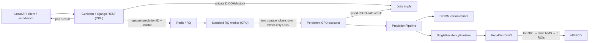

# Architecture and implementation review — 2026-08-11

## Review context

- **Reviewed revision:** `d5d95920ae1c778c33e775c2ba83477c8e035658`
- **Source requirement:** [`ASSIGNMENT.md`](../ASSIGNMENT.md)
- **Scope:** model and preprocessing fidelity, serving architecture, Django/DRF
  behavior, GPU lifecycle, storage and queue semantics, observability, security,
  containers, tests, validation evidence, and documentation drift
- **Source of truth:** implementation code and executable behavior. Historical
  validation records prove only their embedded revisions.
- **Overall verdict:** an unusually disciplined, assessment-grade,
  production-oriented implementation. It substantially satisfies the functional
  assignment, but it is not yet production-ready or a proven reproduction of
  the authors' complete inference contract.

No implementation code was changed as part of this review. Documentation was
updated separately to describe the current behavior and limitations accurately.

## Executive assessment

The best architectural decision is the separation of the HTTP plane, queue
lifecycle, private payload storage, and CUDA ownership. Django and the standard
RQ worker remain CPU-only. One persistent executor owns CUDA, model objects, and
the `SingleResidencyRuntime`. The runtime reuses only the currently resident
model and unloads it before loading the other model.

The design handles the assignment's conflicting requirements—“load once and
reuse” versus “use one model at a time, so it must load and unload”—by keeping
the runtime process persistent while making model residency strict and lazy.
This is a sensible reconciliation, but it is not literal load-once-at-startup
compliance: cross-model requests reload models, and a full request necessarily
switches from detector to classifier.

The main blockers are:

1. the detector-to-MMBCD proposal handoff and label-free text prompt are
   repository-defined contracts without author golden-intermediate parity;
2. private-payload TTL is logical rather than continuously physically enforced;
3. unauthenticated localhost mutation APIs are effectively CSRF-exempt;
4. forked RQ work-horses leave unbounded Prometheus multiprocess shards;
5. executor deadlines, RQ timeouts, admission ownership, and shutdown grace do
   not form a safe hierarchy; and
6. current HEAD has no same-revision packaged L4 acceptance evidence.

## As-built architecture



The web tier performs a complete first DICOM canonicalization before admission.
The executor later canonicalizes the stored DICOM again before inference.

## Assignment verdict

| Assignment area | Verdict | Evidence boundary |
| --- | --- | --- |
| Understand the models and pipeline | Implemented for a deterministic repository contract | Author proposal generation, live-text/laterality behavior, class semantics, calibration, and clinical validity remain unverified |
| Django inference service | Implemented | Generated OpenAPI uses generic response objects, and current packaged GPU proof is pending |
| Appropriate inputs and preprocessing | Implemented within a narrow contract | One Secondary Capture fixture does not prove native mammography SOP, compression, modality, or clinical coverage |
| Load once and reuse | Intentionally reconciled rather than literally met | The persistent runtime reuses only the active model; cross-model requests reload |
| One model at a time | Strong code invariant | Current CPU tests use fakes; real-model proof is revision-bound and short-duration |
| Clean and extensible design | Strong overall | Storage lifecycle ownership and duplicate DICOM processing weaken two seams |
| Production-oriented deployment | Assessment-grade | No auth/TLS/HA/soak/current L4; retention, metrics, readiness, and deadline gaps remain |
| TensorRT considered | Completed with an honest STOP | Static classifier diagnostic only; required dynamic classifier and detector coverage failed; no engine is deployed |
| Docker and reproduction | Implemented | External weights, tokenizer, and source trees are required; current image/L4 rerun is pending |
| Public mammogram DICOM | Met narrowly | The fixture is an uncompressed Secondary Capture object, not broad mammography coverage |

## Design strengths to preserve

### Deep CPU/GPU separation

- The web and RQ images are CPU-only.
- Only the persistent executor receives the NVIDIA device, checkpoints,
  tokenizer, and model-source mounts.
- RQ messages contain only a prediction ID and opaque storage locator.
- The Unix-socket contract avoids moving CUDA state into forked job processes.

Relevant implementation:

- [`compose.yaml`](../compose.yaml)
- [`execution/rq_worker.py`](../src/vision_model_serving/execution/rq_worker.py)
- [`execution/executor.py`](../src/vision_model_serving/execution/executor.py)

### Real single-residency state machine

[`SingleResidencyRuntime`](../src/vision_model_serving/residency/runtime.py)
serializes loading, warmup, inference, switching, and cleanup. A cross-model
request drains and unloads the current adapter before constructing the next one.
Stable executor status permits zero or one resident model, not two.

This is substantially stronger than relying on `torch.cuda.empty_cache()` or a
documentation-only concurrency convention.

### Artifact and offline-loading discipline

- Artifacts are checksum-pinned and revalidated from an open handle.
- Checkpoints use restricted, strict loading.
- Model and tokenizer assets are local; no request-time Hub or Hugging Face
  download is accepted.
- Class names, decision thresholds, calibration, and medical validation are not
  fabricated when the artifacts do not prove them.

Relevant implementation:

- [`config/model-artifacts.json`](../config/model-artifacts.json)
- [`artifacts/registry.py`](../src/vision_model_serving/artifacts/registry.py)
- [`classifier/runtime.py`](../src/vision_model_serving/classifier/runtime.py)

### Strong deterministic image and model contracts

The DICOM path has bounded typed failures, geometry tracking, polarity/LUT/
padding handling, deterministic cropping and resizing, and a narrow declared
syntax set. Detector postprocessing is deterministic and preserves the exact
eight-ROI classifier contract. Results contain host-side typed values rather
than CUDA tensors or live model objects.

### Honest validation and optimization posture

Historical L4 records distinguish deterministic serving compatibility from
medical accuracy. TensorRT promotion is fail-closed: a static MMBCD diagnostic
succeeded, but required dynamic coverage and detector capture did not, so eager
FP32 with TF32 disabled remains selected and no engine was retained.

## Prioritized findings

### P0 — Repository handoff is deterministic but not proven author parity

The released MMBCD material does not include the code that generates its
`*_preds.txt` proposal inputs. Mapping FocalNet-DINO sigmoid/top-300 outputs into
strict `IoU > 0.1` NMS and eight crops is therefore an informed repository
contract, not a reproduced author contract.

The label-free prompt has the same evidence boundary. Released evaluation code
uses ground-truth `cancer` and `all_views_cancer` fields to alter clinical text,
but those labels are unavailable during live inference. The service correctly
avoids that leakage and always uses `Indication: {clinical_history}`, but no
author golden bundle proves this as the intended deployment prompt.

Evidence:

- [`detector/postprocessing.py`](../src/vision_model_serving/detector/postprocessing.py)
- [`classifier/adapter.py`](../src/vision_model_serving/classifier/adapter.py)
- [historical pipeline research](research/vision-serving-pipeline-research.md)
- [artifact inventory](model-artifact-inventory.md)

Required closure:

1. obtain multiple author/institution golden cases containing original DICOM or
   pixel input, ordered proposals, score/NMS behavior, clinical text/laterality
   handling, intermediate tensors, and final logits;
2. compare proposal ordering, crop identity, token inputs, attention inputs, and
   logits under explicit tolerances; and
3. keep all medical class names and thresholds disabled until independently
   verified and calibrated.

### P1 — Request/result TTL does not physically enforce retention

[`EphemeralJobStore.load_request()`](../src/vision_model_serving/execution/storage.py)
reconstructs a stored request without checking `expires_at` or validating the
stored fingerprint. `load_result()` rejects logically expired results but does
not delete their directories. `cleanup_expired()` can remove expired/corrupt
directories, but it is invoked only when gateway or processor objects are
constructed.

Worker-loss handling removes Redis capacity and records metrics but does not
delete the associated locator. Consequently, queued-expired, worker-lost, and
expired-result directories can survive for the lifetime of a long-running
service. The jobs tmpfs is bounded to 1 GiB, so retention can eventually become
an admission outage as well as a privacy failure.

The executable audit confirmed:

```text
expired directory exists before cleanup: true
expired request still loads: true
explicit cleanup removed directory: true
```

Required closure:

- fail closed in `load_request()` when `now >= expires_at`;
- recompute and constant-time compare the fingerprint;
- delete expired data during status/result/request access;
- add a rate-limited, lock-safe periodic janitor or expiry-index consumer;
- clean queue-expired, failed, and worker-lost jobs; and
- test physical bytes/inodes under long-lived churn without reconstructing the
  gateway/processor.

### P1 — Localhost mutation endpoints are effectively CSRF-exempt

[`web/settings.py`](../src/vision_model_serving/web/settings.py) configures no
DRF authentication or permissions. DRF APIViews are CSRF-exempt unless an
authentication mechanism performs the check. The preview and prediction POST
views therefore do not gain protection merely because `CsrfViewMiddleware` is
installed or the workbench form includes a token.

The review reproduced a cross-site multipart preview POST without a CSRF token;
it returned HTTP 200 and `image/png`. Loopback publication prevents direct
remote TCP access but does not prevent a hostile website from issuing a browser
request to localhost. The attacker may be unable to read the response because
of CORS, but can still consume decode, GPU, queue, and disk resources.

Required closure:

- explicitly enforce same-origin/CSRF or Fetch Metadata on mutation routes;
- add missing-token, wrong-token, foreign-`Origin`, and cross-site multipart
  negative tests;
- require authentication before shared-user or remote exposure; and
- rate-limit or perform a cheap capacity preflight before full DICOM decode.

### P1 — Prometheus multiprocess files grow with every RQ work-horse

The standard RQ worker forks one work-horse per job. Each work-horse records
queue-wait metrics through `prometheus_client`, which writes per-PID counter,
histogram, and gauge files into the shared multiprocess directory.

No worker-death or compaction hook exists. Gauges use non-live `max` semantics,
so simply marking a process dead would not solve every stale shard. File count,
scrape cost, and stale maxima grow with completed jobs, while Compose bounds the
metrics tmpfs to 32 MiB.

Evidence:

- [`execution/rq_cli.py`](../src/vision_model_serving/execution/rq_cli.py)
- [`execution/rq_worker.py`](../src/vision_model_serving/execution/rq_worker.py)
- [`observability.py`](../src/vision_model_serving/observability.py)
- [`compose.yaml`](../compose.yaml)

Required closure:

- do not emit Prometheus files from ephemeral per-job processes;
- publish queue metrics through Redis or a long-lived parent/exporter;
- use appropriate live-gauge/process-exit handling for fixed workers; and
- run a thousands-of-jobs plus worker-restart soak that asserts bounded shard
  count, stable scrape latency, and absence of stale gauges.

### P1 — Executor timeout and shutdown ownership are unsafe

The socket client timeout bounds only how long the RQ work-horse waits. Once the
persistent executor begins synchronous processing, it has no propagated
deadline or cancellation mechanism. Killing or timing out the work-horse does
not stop the executor thread.

Current configuration compounds this:

- RQ job timeout defaults to 180 seconds;
- executor socket timeout is 180 seconds;
- RQ worker shutdown grace is 190 seconds; and
- executor shutdown grace is only 30 seconds.

The work-horse can be killed first and release Redis admission capacity while
the GPU executor is still processing the old request. A subsequent job can then
be admitted behind orphaned work. During shutdown, Docker may SIGKILL an
executor request that was allowed a much longer execution timeout.

Required closure:

- establish strict margins: executor task deadline < socket wait < RQ timeout <
  worker/executor shutdown grace;
- retain admission ownership until executor completion is confirmed;
- report active-task age and deadline state;
- treat an uninterruptible overdue CUDA task as executor-unhealthy and restart
  the process; and
- test blocking work, late result writes, RQ child death, and in-flight Compose
  shutdown through the real socket/RQ topology.

### P1 — Artifact readiness is not inference readiness

The executor validates manifest/artifact structure, device availability, source
composition, and native-operator import/CUDA-allocation probes before opening
its socket. It does not construct, strict-load, warm, or execute both real
models at startup. The first request still owns those failure modes.

`artifact_ready` remains true for unloaded/loading/switching states and most
runtime states except terminal failure. RQ readiness also requires only a
non-empty registered worker set, which can briefly outlive a dead worker and
does not enforce exactly one worker.

Required closure:

- keep the current artifact-scoped readiness name and wording;
- add a separately observable inference-capable preflight that loads, warms,
  executes a tiny/golden input, and unloads both stages; and
- enforce or monitor the exact worker/capacity topology if concurrency one is a
  correctness assumption.

### P1 — Current HEAD lacks same-revision GPU acceptance

Current source is `d5d95920...`, while the latest packaged benchmark,
single-residency, restart, browser, and TensorRT evidence records embed earlier
revisions. Those records remain useful historical evidence but do not prove the
current source, dependency set, Docker images, CUDA extension, or artifact
behavior.

Required current-HEAD release gate:

- clean packaged L4 smoke;
- exact detector/classifier hashes;
- destructive two-lifecycle restart;
- schema-v4 cold/warm/switch/concurrency benchmark;
- packaged Chromium workflow;
- repeated detector/classifier switch and allocator/NVML trend soak; and
- confirmation that no current artifact, package, or image identity drifted.

### P2 — DICOM decode occurs before admission and then occurs again

The prediction POST handler reads the complete upload and runs full
canonicalization before asking the gateway for capacity. The store then copies
the bytes, and the executor canonicalizes them again.

Consequences:

- queue capacity does not protect the web tier from decode CPU/memory pressure;
- successful requests pay for two full pixel decodes;
- multiple Gunicorn workers can perform expensive pre-admission work
  concurrently; and
- the synchronous preview endpoint has no GPU-queue backpressure at all.

Required closure:

- perform cheap header/encoded-size checks before admission;
- reserve capacity before expensive canonicalization, with safe rollback; or
- persist a verified canonical artifact plus geometry ledger so the executor
  does not repeat pixel decoding.

### P2 — Cold-stage warmup executes the user input twice

The resident warmup calls the real adapter prediction with the current request
input. After loading/warmup completes, the runtime immediately calls the same
adapter again to produce the returned result. Every cold stage therefore
performs two full forward passes.

Strict residency makes this material: full requests commonly reload both
stages, while historical evidence shows model load/switch time dominates warm
inference time.

Required closure:

- reuse the warmup result for the triggering request; or
- use an explicitly defined, separately validated shape-only warmup input; and
- benchmark a checksum-pinned inference-only detector checkpoint and CPU/pinned
  state caching while preserving one GPU-resident model.

### P2 — API and workbench contract gaps

- Submission, status, and result responses are exposed to OpenAPI as generic
  objects despite strong internal dataclasses.
- The API accepts a detector display threshold, but the typed result does not
  echo it. The workbench reads a nonexistent `display_score_threshold` field and
  therefore reports “model default” even when a threshold was supplied.
- The HTTP layer accepts up to 4,000 clinical-history characters, while the
  tokenizer silently truncates to 90 tokens. The result exposes token count but
  no truncation flag/warning.
- `total_ms` begins inside the executor before its DICOM decode. It excludes
  upload, first decode, admission, queue wait, IPC, persistence, polling,
  serialization, and network time, so it is executor-pipeline latency rather
  than end-to-end latency.

Required closure:

- add named response serializers/components and generated-schema contract tests;
- echo the applied display threshold in typed provenance or remove the
  misleading UI row;
- return an explicit clinical-text truncation flag/warning; and
- expose separately named queue, executor-pipeline, HTTP wall, and client
  end-to-end timings.

### P2 — DICOM applicability, memory, and privacy boundaries

The canonicalizer validates grayscale, frame count, size, syntax, and pixel
processability but does not require `Modality == "MG"` or a mammography SOP
class. Any supported single-frame monochrome object can reach the model.

The 80-million-pixel limit is also not a tight peak-memory bound. Normalization
creates float64 arrays and indexed copies; one full float64 array at the limit
is roughly 640 MB, with multiple decoded/transformed arrays potentially alive.
Highly compressible RLE can reach that working set from a relatively small
encoded upload.

Metadata minimization is not de-identification. Preview generation does not
inspect `BurnedInAnnotation`, run OCR, or redact pixel text. Result JSON also
contains a stable source-file SHA-256 and derived medical predictions. Preview
PNGs, overlays, hashes, and results therefore remain sensitive.

Required closure:

- enforce an explicit modality/SOP policy or document a deliberate assessment-
  fixture exception;
- compute decoded-byte/working-set bounds from dimensions, samples, and bit
  depth, then add cgroup memory limits;
- test adversarial near-limit compressed inputs; and
- keep preview/result artifacts local and access-controlled unless a real pixel
  de-identification pipeline is added.

### P2 — Additional hardening gaps

- The FocalNet source gate verifies pinned HEAD, expected patch state, and
  `git diff --check`, but does not reject every additional tracked/untracked
  executable change. Use an exact approved diff or complete tree manifest.
- Runtime unload proves the adapter object is unreachable but has no enforced
  allocator/NVML residual-memory budget. Add a 100+ switch trend soak and a
  justified post-unload baseline.
- Gunicorn access logs contain raw prediction result/status paths, exposing
  capability-style prediction IDs despite the safer application telemetry.
  Redact dynamic path segments or disable the redundant access log.
- Whole-tree Ruff format is not clean: 45 pre-existing Python files would be
  reformatted, while CI intentionally checks formatting only on changed Python
  files.

## Documentation drift corrected

The review aligned current documentation with the implementation while leaving
historical validation artifacts unchanged:

- [`SPEC.md`](../SPEC.md) is now an as-built baseline rather than a proposed
  future topology.
- The spec now shows CPU Django/RQ plus the persistent GPU executor instead of a
  CUDA-owning RQ work-horse.
- Response examples now use the real `{prediction_id, result}` envelope and raw
  class indices/logits/probabilities—no invented benign/malignant labels or
  threshold.
- Empty proposals now correctly fail closed rather than using a fallback crop.
- Error codes and 400/413/415/422 mappings match the Django adapter.
- Status/UI wording now describes lifecycle progress rather than nonexistent
  live model-stage progress.
- Compose profiles, readiness scope, logging event families, image-size
  provenance, and timeout/shutdown behavior now match the source.
- TTL wording now distinguishes logical expiry from startup-scoped physical
  cleanup.
- Prometheus counters are documented as metrics-directory/volume lifetime, with
  unreaped work-horse shards disclosed.
- “Sanitized” and “non-PHI” export claims were replaced with accurate
  metadata-minimized-but-sensitive wording.
- 2026-08-10 corrected single-residency evidence is linked consistently and
  current-HEAD L4 acceptance remains explicitly pending.
- Historical pre-implementation and TensorRT research documents are labeled and
  reconciled with the completed STOP experiment.

Current operational gaps are summarized in:

- [`README.md`](../README.md#current-operational-gaps)
- [`architecture.md`](architecture.md#current-operational-limitations)
- [`traceability.md`](traceability.md#current-review-gaps)

## Validation performed during the review

| Check | Result |
| --- | --- |
| Python 3.12 CPU suite | 222 passed, 3 skipped |
| Chromium workbench suite | 2 passed |
| Focused single-residency fake tests | 15 passed |
| `uv lock --check` | Passed |
| Ruff lint using the CI-pinned version | Passed |
| `manage.py check` | Passed |
| Hardened `manage.py check --deploy` | Passed |
| Generated OpenAPI validation | Passed |
| Artifact manifest validation | Passed; semantics remain disabled/unverified |
| All-profile Compose configuration | Passed with an explicit fixture path |
| Documentation local-link check | Passed |
| `git diff --check` | Passed |

The CPU and browser results establish strong control-plane and contract
confidence. They do not establish current CUDA/native-operator behavior, real
checkpoint loading, allocator stability, packaged image correctness, latency,
throughput, or medical validity.

## Environment note

A pre-existing running Django process held binaries in the untracked `.venv`.
A frozen synchronization attempt failed on locked PIL/OpenCV files and may have
left that local environment incomplete. The process was not terminated and the
user-owned `.venv` was not deleted or replaced. Reported validation was run from
an isolated Python 3.12 audit environment instead.

The review also preserved the pre-existing `.gitignore`, `skills-lock.json`, and
untracked `.venv` worktree state.

## Recommended implementation order

1. **Close fidelity uncertainty:** obtain author golden proposals/prompts/logits.
2. **Fix physical retention:** expiry validation, deletion-on-access, periodic
   janitor, worker-loss cleanup, and tmpfs monitoring.
3. **Protect browser mutation routes:** Origin/Fetch-Metadata/CSRF enforcement,
   authentication boundary, rate limits, and negative tests.
4. **Move RQ metrics out of ephemeral work-horses** and run process-churn soak.
5. **Define executor deadline ownership** and safe shutdown/restart semantics.
6. **Separate artifact readiness from inference-capable preflight.**
7. **Remove duplicate decode and duplicate cold forward passes.**
8. **Complete response schemas, threshold/truncation provenance, and latency
   semantics.**
9. **Harden DICOM memory/modality and source-tree/logging boundaries.**
10. **Run clean current-HEAD L4 smoke, restart, browser, schema-v4 benchmark,
    golden hashes, and long switch/leak soak.**

Only after these gates pass should the repository be described as production-
ready rather than assessment-grade and production-oriented.
