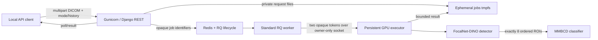

# Serving architecture and operational contracts

## Deployed topology

The web and RQ images are CPU-only. Only the executor receives an NVIDIA
device and read-only checkpoint, tokenizer, and source mounts. Redis and the
Unix socket are reachable only on the internal Compose backend/shared tmpfs.
Web alone also joins a no-masquerade edge bridge for the loopback HTTP port.

## Module seams

| Module | Owns | Does not own |
| --- | --- | --- |
| `artifacts` | Manifest parsing, hash/shape/runtime/operator verification, authorized local artifact resolution | Model construction or public artifact registration |
| `dicom` | Bounded decode, pixel transforms, canonical array, warnings, reversible geometry | File persistence or patient metadata output |
| `detector` | Strict FocalNet-DINO load, transform, raw tensors, top-300/NMS/eight-ROI contract | Classifier semantics or HTTP filtering policy |
| `classifier` | Strict MMBCD load, eight crops, local tokenizer, label-free prompt, raw logits/probabilities | Clinical labels, thresholds, or causal explanations |
| `pipeline` | Detector-then-optional-classifier ordering and typed serializable result | Queueing, HTTP, or device ownership |
| `residency` | Serialized one-resident lifecycle, compatible reuse, unload-before-switch, memory/timing observations | Redis job state or API schemas |
| `execution` | Private job storage, capacity/idempotency, RQ state, socket protocol, persistent executor | HTTP parsing or medical interpretation |
| `web` | Multipart validation, inspection/operations UIs, submission/poll/result endpoints, one bounded operational snapshot, readiness/inventory/OpenAPI | CUDA import, model objects, or checkpoint paths |
| `observability` | Bounded Prometheus labels and structured safe events | Clinical audit logs or request payload logging |
| `validation` | Packaged acceptance, exact environment binding, benchmark/optimization/TensorRT evidence contracts, and fail-closed promotion | CLI parsing, HTTP transport ownership, or fabricated GPU measurements |

These are deep interfaces: callers exchange immutable host-side contracts,
not PyTorch modules, CUDA tensors, DICOM datasets, or filesystem paths.

## Detector-to-classifier flow

1. Django bounds and decodes the uploaded DICOM before queue admission.
2. The gateway writes DICOM/history beneath a random locator in the jobs tmpfs;
   Redis receives only opaque identifiers and lifecycle metadata.
3. The executor canonicalizes pixels to immutable 1024×1024 `uint8` plus a
   geometry ledger.
4. FocalNet-DINO emits raw logits and 900 normalized boxes. The adapter applies
   sigmoid, deterministic top-300 selection, strict `IoU > 0.1` NMS, bounds,
   and exactly eight ordered ROIs.
5. Detection mode ends. Full mode crops the same eight ROIs, formats the
   label-free `Indication:` prompt, tokenizes from the pinned offline snapshot,
   and runs MMBCD.
6. The result contains finite host values, provenance, timings, warnings,
   original/canonical coordinates, and the source-file SHA-256. It excludes
   pixels, history, prompt text, DICOM metadata identifiers, model objects, and
   invented medical semantics, but the stable hash keeps the JSON sensitive.

The local workbench at `/` uses these same public resources. Its preview route
canonicalizes the selected DICOM into a grayscale PNG without copying DICOM
metadata, marks the response `no-store`, and retains nothing. It does not detect
or redact burned-in pixel annotations, so the preview and browser-derived ROI/
overlay exports remain sensitive and are not certified de-identified. ROI crops
and overlays are derived in the browser from that preview plus canonical result
coordinates; no second inference path or server-side image history exists.

## GPU lifecycle: strict single residency

The executor starts with verified artifacts and an initialized controller but
no loaded model. Its first detection loads and warms the detector. A repeated
detection reuses that sole resident. A full request reuses the detector only if
it is active, then unloads it before loading MMBCD. A later detector request
unloads MMBCD before reloading the detector. Stable status is empty or exactly
`[active_model]`; impossible dual-resident socket status is rejected.

The process remains persistent for RQ isolation and artifact/device
verification, while model residency follows the assignment literally.
[`ADR 0003`](adr/0003-enforce-single-model-residency.md) supersedes only the
dual-residency portion of ADR 0002. The explicitly dual-resident 2026-08-08/09
packaged records describe the former topology; direct and corrected 2026-08-10
single-residency records remain valid only for their embedded revisions.

## Queue and failure semantics

- RQ is the job-lifecycle authority; the Unix socket is synchronous IPC, not a
  second queue. ADR 0001 records why Celery was not selected.
- Capacity counts pending plus running work and defaults to one. Admission and
  enqueue are one Redis transaction.
- The standard RQ worker preserves per-job work-horse isolation. CUDA lives
  only in the independently restartable executor.
- Automatic retries are disabled because repeating inference after an unknown
  GPU failure is not known safe. Worker/executor loss becomes one terminal job.
- Synchronous wait is bounded; timeout returns a pollable handle without
  cancelling healthy work. Results and status have explicit independent TTLs.
- Executor startup fails closed before opening its socket if artifacts,
  runtime, device, or native operator do not verify.

The complete mapping from failures to HTTP behavior is in
[`gpu-execution-gateway.md`](gpu-execution-gateway.md#failure-outcomes).

## Health and observability

`/livez` proves only the web process. `/readyz` is scoped to
`artifact_ready`: it requires Redis, a registered RQ worker, the initialized
executor, verified artifact structure, an L4 device, and native-operator import/
CUDA-allocation probes. It does not construct, strict-load, warm, or execute
both models, and the RQ registration check can briefly outlive a dead worker.
It may therefore be HTTP 200 while the runtime is unloaded or a first inference
would fail. The repository manifest and telemetry
collector are also fail-closed readiness checks. `inference_warm` and
`warm_model` report model-specific warmth. `/api/v1/models` exposes manifest
identity and sanitized runtime state without paths. `/api/v1/operations` is the
shared bounded snapshot behind readiness, model inventory, the `/monitoring`
console, and the queue/executor portion of Prometheus export, preventing those
surfaces from disagreeing about live state. The `/metrics` export is disabled by
default and, when enabled, is restricted to configured trusted networks.

Structured logs and metrics use bounded repository-owned labels. They exclude
request/prediction IDs from executor events, clinical history, filenames,
patient/study/series/SOP identifiers, token text, local paths, and exception
messages. Details are in [`observability.md`](observability.md).

## Security, trust, and retention

- The API binds to `127.0.0.1` by default. It has no authentication layer; add
  authenticated TLS ingress before any remote or multi-user exposure. The DRF
  API views do not enforce CSRF, so loopback binding alone does not prevent a
  hostile web page from issuing cross-site multipart POST workloads.
- Containers run non-root, read-only, with all capabilities dropped and
  `no-new-privileges`. Model and source mounts are read-only.
- Checkpoints are authorized only by manifest identity and restricted CPU
  inspection. User-supplied model upload/registration is not an API feature.
- Request DICOM/history files are removed after normal execution. API result
  expiry is logical; physical cleanup of expired, abandoned, corrupt, or
  worker-lost job directories currently runs only when gateway/processor
  objects start. A long-lived stack can therefore retain data beyond the TTL
  and fill the 1 GiB jobs tmpfs. Redis persistence is disabled, and complete
  stack teardown with `--volumes` removes socket, jobs, and metrics.
- Checkpoint redistribution rights and MMBCD licensing remain unresolved.
  Images and Git history contain no weights.

## Supported and unvalidated boundaries

The declared DICOM support is single-frame grayscale with explicit bounded
uncompressed/RLE paths; see [`dicom-canonicalization.md`](dicom-canonicalization.md).
The public fixture is one uncompressed Secondary Capture object. It proves
compatibility and deterministic FP32 execution only—not native mammography
coverage, accuracy, calibration, robustness, class semantics, or clinical
utility. PyTorch optimization and TensorRT are implemented as isolated,
fail-closed L4 evidence lanes. Eager FP32 remains the selected backend until
same-revision parity and performance evidence passes.

## Current operational limitations

- Django now validates only DICOM structure (`validate_header`, no pixel
  decode) before admission; pixels are decoded once, in the executor.
  Pixel-level failures on accepted uploads therefore surface asynchronously as
  terminal `prediction_case_failed` states. `total_ms` still measures only the
  executor pipeline rather than upload, queue, IPC, persistence, or polling.
- Cold loads no longer run the patient case twice: the composition-root warmup
  hook is a no-op and the cold request's own forward pass is the warm pass.
- The timeout hierarchy is strict (socket wait 170 s < RQ job timeout 180 s <
  worker grace 190 s < executor grace 210 s). A killed work-horse can still
  release Redis capacity while uncancelled executor work finishes, but the
  executor fails fast with a retryable busy signal on overlap, and expired
  requests fail closed at `load_request`.
- RQ work-horses no longer write Prometheus multiprocess files (queue-wait
  accounting lives in Redis); a gunicorn `child_exit` hook reaps dead
  web-worker shards. Telemetry writes are exception-guarded so a full metrics
  volume degrades observability instead of failing requests, and readiness no
  longer depends on the telemetry collector.
- Concurrency one is a Compose topology assumption. The worker healthcheck now
  requires a local worker with a fresh heartbeat, and the runtime serializes
  model calls rather than a complete detector-to-classifier transaction.
- These closures are validated by the CPU suite; the same-revision packaged L4
  acceptance rerun remains outstanding.
