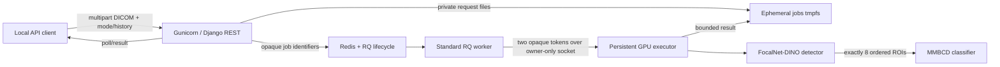

# Serving architecture and operational contracts

## Deployed topology

The web and RQ images are CPU-only. Only the executor receives an NVIDIA
device and read-only checkpoint, tokenizer, and source mounts. Redis and the
Unix socket are reachable only on the internal Compose network/shared tmpfs.

## Module seams

| Module | Owns | Does not own |
| --- | --- | --- |
| `artifacts` | Manifest parsing, hash/shape/runtime/operator verification, authorized local artifact resolution | Model construction or public artifact registration |
| `dicom` | Bounded decode, pixel transforms, canonical array, warnings, reversible geometry | File persistence or patient metadata output |
| `detector` | Strict FocalNet-DINO load, transform, raw tensors, top-300/NMS/eight-ROI contract | Classifier semantics or HTTP filtering policy |
| `classifier` | Strict MMBCD load, eight crops, local tokenizer, label-free prompt, raw logits/probabilities | Clinical labels, thresholds, or causal explanations |
| `pipeline` | Detector-then-optional-classifier ordering and typed serializable result | Queueing, HTTP, or device ownership |
| `residency` | Serialized accelerator lifecycle, reuse/retention, memory/timing observations | Redis job state or API schemas |
| `execution` | Private job storage, capacity/idempotency, RQ state, socket protocol, persistent executor | HTTP parsing or medical interpretation |
| `web` | Multipart validation, inspection/operations UIs, submission/poll/result endpoints, one bounded operational snapshot, readiness/inventory/OpenAPI | CUDA import, model objects, or checkpoint paths |
| `observability` | Bounded Prometheus labels and structured safe events | Clinical audit logs or request payload logging |

These are deep interfaces: callers exchange immutable host-side contracts,
not PyTorch modules, CUDA tensors, DICOM datasets, or filesystem paths.

## Detector-to-classifier flow

1. Django bounds and decodes the uploaded DICOM before queue admission.
2. The gateway writes DICOM/history beneath a random locator in the jobs tmpfs;
   Redis receives only opaque identifiers and lifecycle metadata.
3. The executor canonicalizes pixels to immutable 1024×1024 `uint8` plus a
   geometry ledger.
4. FocalNet-DINO emits raw logits and 900 normalized boxes. The adapter applies
   sigmoid, deterministic top-300 selection, strict `IoU > 0.1` NMS, bounds,
   and exactly eight ordered ROIs.
5. Detection mode ends. Full mode crops the same eight ROIs, formats the
   label-free `Indication:` prompt, tokenizes from the pinned offline snapshot,
   and runs MMBCD.
6. The result contains finite host values, provenance, timings, warnings, and
   original/canonical coordinates. It excludes pixels, history, prompt text,
   DICOM identifiers, model objects, and invented medical semantics.

The local workbench at `/` uses these same public resources. Its preview route
canonicalizes the selected DICOM into a metadata-free grayscale PNG, marks the
response `no-store`, and retains nothing. ROI crops and overlays are derived in
the browser from that preview plus canonical result coordinates; no second
inference path or server-side image history exists.

## GPU lifecycle: active is not resident

The executor starts with verified artifacts but no loaded models. Its first
detection loads and warms the detector. The first full request reuses that
detector, then loads the classifier and retains both. Later detection/full
requests serialize on one execution lock and reuse both residents; only the
currently executing stage is `active_model`.

This is an accepted change from the original strict-switching implementation.
[`ADR 0002`](adr/0002-use-a-persistent-gpu-executor.md) records why the deployed
path retains both models: the strict unload/reload proof was correct but caused
large repeat latency, while dual residency used 2,334 MiB and reduced a
validated warm full request to roughly 1.2 seconds. The original assignment
also says “one model at a time, load and unload.” The deployed topology does
not satisfy that sentence literally. It instead guarantees one GPU owner and
one active inference at a time. If literal single residency is mandatory, use
the proven switching policy in `SingleResidencyRuntime` and accept/re-measure
its reload latency; do not describe dual residency as equivalent.

## Queue and failure semantics

- RQ is the job-lifecycle authority; the Unix socket is synchronous IPC, not a
  second queue. ADR 0001 records why Celery was not selected.
- Capacity counts pending plus running work and defaults to one. Admission and
  enqueue are one Redis transaction.
- The standard RQ worker preserves per-job work-horse isolation. CUDA lives
  only in the independently restartable executor.
- Automatic retries are disabled because repeating inference after an unknown
  GPU failure is not known safe. Worker/executor loss becomes one terminal job.
- Synchronous wait is bounded; timeout returns a pollable handle without
  cancelling healthy work. Results and status have explicit independent TTLs.
- Executor startup fails closed before opening its socket if artifacts,
  runtime, device, or native operator do not verify.

The complete mapping from failures to HTTP behavior is in
[`gpu-execution-gateway.md`](gpu-execution-gateway.md#failure-outcomes).

## Health and observability

`/livez` proves only the web process. `/readyz` requires Redis, an RQ worker,
the executor, verified artifacts, an L4 device, and the functional native
operator. `/api/v1/models` exposes manifest identity and sanitized runtime
state without paths. `/api/v1/operations` is the shared bounded snapshot behind
readiness, model inventory, the `/monitoring` console, and the queue/executor
portion of Prometheus export, preventing those surfaces from disagreeing about
live state. `/metrics` is disabled by default and, when enabled, is restricted
to configured trusted networks.

Structured logs and metrics use bounded repository-owned labels. They exclude
request/prediction IDs from executor events, clinical history, filenames,
patient/study/series/SOP identifiers, token text, local paths, and exception
messages. Details are in [`observability.md`](observability.md).

## Security, trust, and retention

- The API binds to `127.0.0.1` by default. It has no authentication layer; add
  authenticated TLS ingress before any remote or multi-user exposure.
- Containers run non-root, read-only, with all capabilities dropped and
  `no-new-privileges`. Model and source mounts are read-only.
- Checkpoints are authorized only by manifest identity and restricted CPU
  inspection. User-supplied model upload/registration is not an API feature.
- Request DICOM/history files are removed after execution. Bounded results live
  in the jobs tmpfs only for the result TTL; Redis persistence is disabled.
  Complete stack teardown with `--volumes` removes socket, jobs, and metrics.
- Checkpoint redistribution rights and MMBCD licensing remain unresolved.
  Images and Git history contain no weights.

## Supported and unvalidated boundaries

The declared DICOM support is single-frame grayscale with explicit bounded
uncompressed/RLE paths; see [`dicom-canonicalization.md`](dicom-canonicalization.md).
The public fixture is one uncompressed Secondary Capture object. It proves
compatibility and deterministic FP32 execution only—not native mammography
coverage, accuracy, calibration, robustness, class semantics, or clinical
utility. TensorRT and other acceleration paths remain unimplemented gates.
